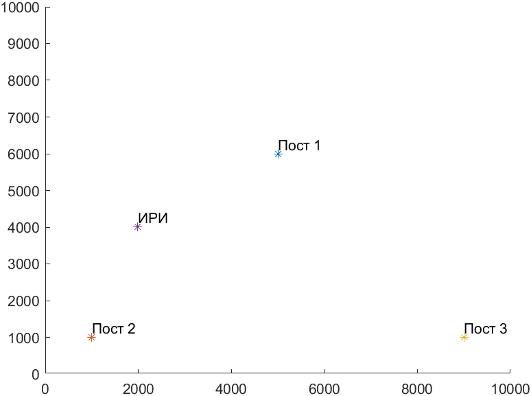

В качестве тестового задания необходимо решить 3 задачи на выбор.

6 Реализовать простой синтезатор частот.
Использовать алгоритм Карплуса-Стронга
Входом является набор частот в звуковом диапазоне, частота дискретизации, длительность в секундах.
Выходом является сигнал, который допустимо записать в файл либо вывести на звуковую карту.
При записи в файл привести отсчеты к формату int16.
Любые модификации, дополнительные алгоритмы, параметры (коэффициент затухания и т.д.) и интерфейс остаются на усмотрение соискателя и приветствуются.

В предложенной мною реализации данные звуковые сигралы хранятся в обычном vector.
Задержка равна кол-ву входных частот
Фильт представляет собой функцию y(t) = y(t-freq_size) * 0.75
Также приведён пример записи аудио-дорожки в файл wav.

2.9	Задача на РДМ.
Даны координаты трех постов на двумерной плоскости
x1 = 5000;
y1 = 6000;
x2 = 1000;
y2 = 1000;
x3 = 9000;
y3 = 1000.

Известно, что задержка сигнала (разность хода) между первым и вторым постом dt12, а между первым и третьем постом dt13, которые равны:

dt12 = 1.47 мксек;
dt13 = -13.4 мксек.

Необходимо найти координату ИРИ (источника радиоизлучения), используя метод РДМ (разностно — дальномерный метод). На matlab построить график положения ИРИ относительно постов. К решенной задаче приложить скриншоты графиков.

В резульатате рассчётов координаты ИРИ были определены как [1990, 4009].
Полученный график находится в папке с заданием

